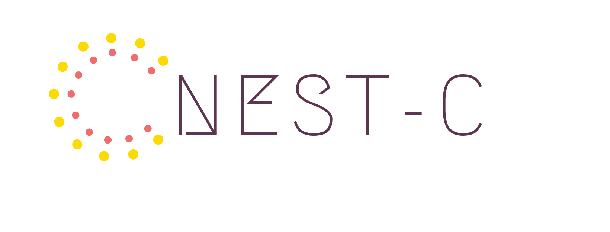
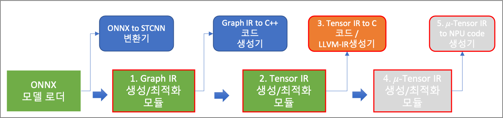
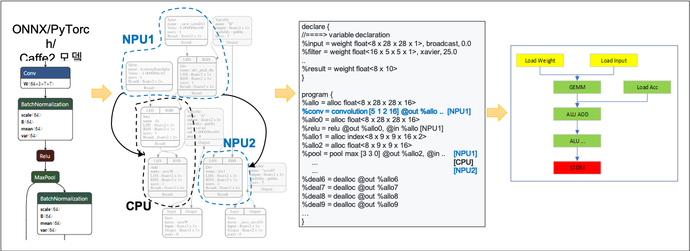

<!----->
 

## Overview  

The NEST Compiler (NEST-C) is an open source project led by ETRI, which is based on [GLOW project] (https://github.com/pytorch/glow). 

Glow is a machine learning compiler and execution engine for hardware
accelerators. It is designed to be used as a backend for high-level machine
learning frameworks. The compiler is designed to allow state of the art
compiler optimizations and code generation of neural network graphs. 

The objective of NEST-C is to generate optimized code for various kinds of Neural-network Processing Uints (NPUs). Therefore, NEST-C provides automatic tuning functionalities and tools for each optimization step.  

<b>Optimization modules and tools of NEST-Compiler</b>

  

<b> Input/output examples of NEST-C modules </b>

## Features
* NPU HW backend supporting EVTA series
* Automatic backend parameter tuning (under development)
* Profile-based dyanamic quantization for supporting various NPU backends
* C/C++ code generation for embedded HWs supporting gcc/llvm compilers
* Profile-based graph partitioning

## Documentation

* [Installation](docs/nestc/install.md)
* [Docker Setting](docs/nestc/DockerSetting.md)
* [Testing and Running](docs/nestc/testing.md)
* [EVTA](docs/nestc/evta.md)
* [Quantization](docs/nestc/quantization.md)
* [Profile-based Graph Partitioning](docs/nestc/NestPartitioner-kor.md)
* [C/C++ code generator](docs/nestc/KCC2020-ccodegen-publish.pdf)

## Demo

## Partners

Contributions to NEST-C are welcomed and encouraged! 

## License

NEST-C is licensed under the [Apache 2.0 License](LICENSE).

