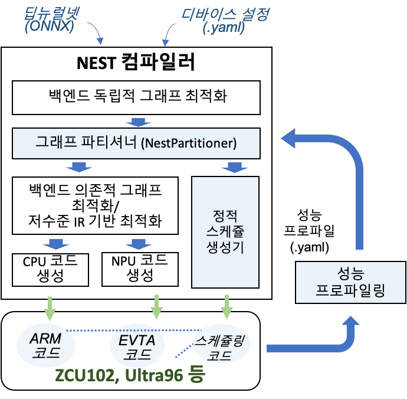
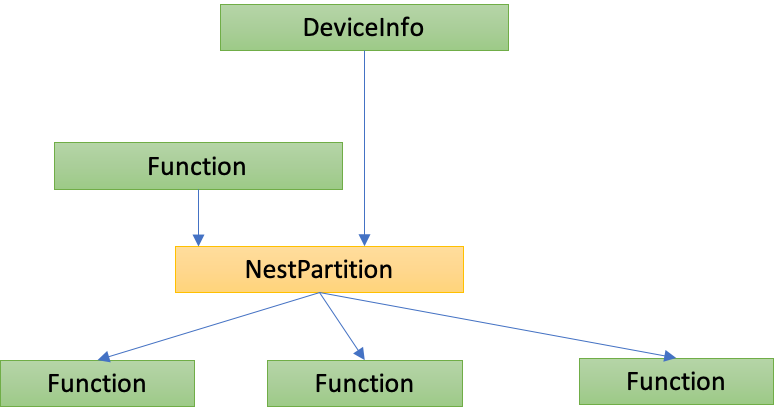

## NEST-C의 프로파일 기반 파티셔닝

### 개요
임베디드 시스템은 CPU 뿐 만 아니라 NPU, GPU와 같은 다양한 프로세싱 유닛 (PU)을 포함하고 있고, 뉴럴넷 컴파일러는 입력 뉴럴넷을 이러한 임베디드 시스템에서    최적의 성능을 낼 수 있는 코드로 변환해야 한다. 그러므로, 뉴럴넷 컴파일러는 입력 뉴럴넷의 어느 부분 (서브 네트워크)을 어떤 PU에서 실행하지를 결정해야한다. 즉, 뉴럴넷 컴파일러는 다양한 PU를 가지고 있는 임베디드 시스템에서 효율적으로 동작하는 코드를 생성하기 위해 뉴럴넷을 어떻게 나눠어 (파티셔닝 하여) 백엔드에 할당할지를 결정해야 한다. NEST-C의 파티셔너는 이러한 파티셔닝을 효과적으로 수행하기 위하여, 뉴럴넷을 구성하는 각 연산 및 퓨징된 연산을 컴파일러의 백엔드를 통해 실제 코드를 생성하고, 해당 코드를 타겟 PU상에서 수행한 후, 최종 수행 시간을 기반으로 최적의 파티션을 생성한다. 파티셔너의 구조 및 동작은 ISET2020 논문 [NEST-C Partitioner](https://gitlab.com/yongin.kwon/nest-compiler/-/tree/master/docs/ISET_YU-67-70.pdf)에 자세히 설명되어 있다.


#### 설계
아래 그림은 NEST-C의 파티셔닝 시스템의 구조를 보여준다. NEST-C의 파티셔닝 시스템은 NEST-C의 백엔드 독립적 그래프 최적화가 이루어 진 이후의 그래프를 기반으로 이루어진다. NEST-C의 NestPartitioner 클래스에서 그래프 파티셔닝이 이루어지며, HW에 포함된 프로세싱 유닛 (PU)의 연상성능 프로파일을 기반으로 가장 빠르게 추론이 수행될 수 있도록 그래프의 각 노드와 백엔드를 매칭시키는 방식으로 수행된다. 

<center></center>

아래 그림은 NestPartitioner의 구조를 보여준다. 

<center></center>

NestPartitioner는 DeviceInfo에 기술되어 있는 PU들의 정보를 바탕으로 (1) Function의 각 노드를 각 PU에서 실행 가능한 프로파일링 코드로 변환하여 실행한 후 (현재는 수동으로 실행), (2) 성능 정보를 자동으로 추출하고, (3) 추출된 성능 정보를 바탕으로 최적의 그래프 파티션과 컴파일 된 파티션 코드를 생성한다.


#### 프로파일러 사용 방법 
NEST-C 파티셔너의 최적 파티션 생성 기능을 사용하기 위해서는 타겟 시스템상에서 프로파일링을 수행해야 한다. 프로파일링은 NEST-C 파티셔너가 생성한 프로파일링용 코드를 타겟 시스템 상에서 실행하면 성능결과를 포함하고 있는 성능프로파일 (.yaml)파일이 자동으로 생성된다. NEST-C 파티셔너는 이 yaml 파일을 이용하여 최적의 파티션 및 파티션 코드를 생성한다. 성능프로파일을 생성하기 위한 절차는 아래와 같다.

1.  타겟 시스템 명세
타겟 시스템이 포함하고 있는 PU의 종류와 해당 PU용 코드를 생성하는 백엔드의 이름, PU의 ID, 지원/비지원 연산을 기술한다. 타겟 시스템 명세는 사용자가 yaml 파일 (예:  [device yaml file sample](https://gitlab.com/yongin.kwon/nest-compiler/-/blob/master/tests/runtime_test/VTATestDeviceConfigs.yaml)로 파티셔너에 제공해야 한다. 

2. 퓨징 연산 명세 (선택)
백엔드가 지원하는 퓨징 연산을 설정한다. PU용 백엔드 개발자가 yaml 파일 (예: [fusing yaml file sample](https://gitlab.com/yongin.kwon/nest-compiler/-/blob/master/tests/runtime_test/profileConfigs.yaml))로 제공해야 한다. 


3. model-partition-tuner를 이용하여 프로파일용 코드를 생성한다. 

코드를 생성할 입력 뉴럴넷과 타겟의 종류, 생성된 코드를 저장할 패스 등을 지정하고 프로파일링 옵션 (profile-mode)을 '1'로  설정하여 아래와 같이 model-partition-tuner를 실행한다. 'profile-path'로 지저된 디렉토리 아래에는 파티션 정보가 yaml 형식으로 저장된다. 생성되는 파티션의 종류는 exe-type 옵션으로 설정한다. 다른 커맨드라인 옵션들은 Glow 컴파일러와 동일하다.

3.1 개별 연산 및 퓨징연산 프로파일링을 위한 파티션 정보 생성

```
./model-partition-tuner -model-input=data,float,[1,224,224,3] -m=/Users/msyu/CLionProjects/nest-compiler/tests/models/nestModels/mxnet_exported_resnet18/mxnet_exported_resnet18.onnx -nest-log-partition -load-device-configs=/Users/msyu/CLionProjects/nest-compiler/tests/runtime_test/VTATestDeviceConfigs.yaml -profile-path="/Users/msyu/Dropbox/Project/development/configs/resnet18_partition_perform_profile" -exe-type=1 -emit-bundle=partition_profile_cpu
```

3.2 프로파일 코드 생성 및 실행
3.1을 실행하면 컴파일러의 그래프 (또는 계산 그래프)의 개별 노드를 개별 파티션으로 분리하여 가용 PU들에 할당한 파티션 정보 파일과 퓨징 가능한 연산들을 묶어서 PU들에 할당한 파티션 정보 파일들이 생성되는데, 이 파티션 정보파일들 별로 model-partition-tuner를 이용하여 아래와 같이 프로파일링 코드를 생성한다.

```
./model-partition-tuner -model-input=data,float,[1,224,224,3] -m=/Users/msyu/CLionProjects/nest-compiler/tests/models/nestModels/mxnet_exported_resnet18/mxnet_exported_resnet18.onnx -nest-log-partition -load-device-configs=/Users/msyu/CLionProjects/nest-compiler/tests/runtime_test/VTATestDeviceConfigs.yaml -profile-path="/Users/msyu/Dropbox/Project/development/configs/resnet18_partition_perform_profile" -partition-plan="/Users/msyu/CLionProjects/nest-compiler/tests/runtime_test/resnet18_partition_perform_profile/initialFusedNodePartitionVTA1.yaml" -emit-bundle=fused_partition_profile_vta -bundle-api=dynamic -load-profile=/Users/msyu/CLionProjects/nest-compiler/tests/models/nestModels/mxnet_exported_resnet18/mxnet_exported_resnet18_calib_1.yaml -quantization-schema=symmetric_with_power2_scale -target=aarch64 -mcpu=cortex-a53 -exe-type=0 -profile-mode=1
```

위 커맨드를 실행하면 'emit-bundle'로 명시한 디렉토리에 파티션 별 코드 (.o 또는 .cpp), 파티션 전체 실행을 위한 main.cpp, 컴파일을 위한 CMakeLists.txt가 생성된다. 생성된 파일을 타겟 시스템으로 옮겨 컴파일을 하여 생생된 실행파일을 실행하면 그래프의 개별연산/퓨징연산 실행 성능이 저장된 yaml파일이 생성된다. 


#### 최적 파티션 및 파티션 코드 생성 방법
NEST-C의 파티셔너는 프로파일링 결과를 기반으로 이루어지므로 '3.2 프로파일 코드 생성 및 실행'을 통해 생성된 yaml 파일을 입력으로 받는다. yaml 파일들은 'profile-path' 로 명시된 디렉토리 밑의 'test' 폴더에 들어있어야 한다. 프로파일 기반 파티셔닝은 아래와 같은 커맨드 실행하며, 실행 결과로 파티션코드, main.cpp, CMakeLists.txt가 생성된다. 생성된 파일은 타겟 시스템에서 컴파일하여 사용하면 된다. 
 

```
./model-partition-tuner -model-input=data,float,[1,224,224,3] -m=/Users/msyu/CLionProjects/nest-compiler/tests/models/nestModels/mxnet_exported_resnet18/mxnet_exported_resnet18.onnx -nest-log-partition -load-device-configs=/Users/msyu/CLionProjects/nest-compiler/tests/runtime_test/VTATestDeviceConfigs.yaml -profile-path="/Users/msyu/Dropbox/Project/development/configs/resnet18_partition_perform_profile" -exe-type=3
```


### 파티션 명세 및 사용자 정의 파티션

NEST-C 파티셔너는 사용자 정의 파티션 (user-defined partition)을 지원한다. 사용자 정의 파티션은 yaml 파일 형식으로그래프의 각 노드가 어느 PU에 할당될 지를 명시하면 된다. 사용자 정의 파티션 예제는[Patition specification](https://gitlab.com/yongin.kwon/nest-compiler/-/blob/nest_compiler_20.11/tests/runtime_test/resnet18_partition_perform_profile/NESTOptimalPlan.yaml)을 참고한다.

사용자 정의 파티션을 이용하여 타겟 시스템용 코드를 생성하는 방법은 'profile-mode'의 값을 생략 (혹은 0으로 설정)하여 '3.2 프로파일 코드 생성 및 실행'에서 설명한 방법과  동일하게 실행하면 된다.

```
./model-partition-tuner -model-input=data,float,[1,224,224,3] -m=/Users/msyu/CLionProjects/nest-compiler/tests/models/nestModels/mxnet_exported_resnet18/mxnet_exported_resnet18.onnx -nest-log-partition -load-device-configs=/Users/msyu/CLionProjects/nest-compiler/tests/runtime_test/VTATestDeviceConfigs.yaml -partition-plan="/Users/msyu/Dropbox/Project/development/configs/resnet18_partition_perform_profile/NESTOptimalPlan.yaml" -exe-type=0 -emit-bundle=optimal_partition -bundle-api=dynamic -load-profile=/Users/msyu/CLionProjects/nest-compiler/tests/models/nestModels/mxnet_exported_resnet18/mxnet_exported_resnet18_calib_1.yaml -quantization-schema=symmetric_with_power2_scale -target=aarch64 -mcpu=cortex-a53
```


### 디버깅 지원
NEST-C의 파티셔너가 분할한 서브 그래프들의 정보는 ' -nest-log-partition' 옵션을 실행시에 명시에 주면 화면에 출력해 볼 수 있다. 출력되는 정보는 아래와 같이 파티션 명, 할당된 백엔드 명, 입출력 크기 등을 포함하고 있다. 

```
I1214 17:10:45.922410 506592768 NestPartitioner.cpp:79] The number of partitions is : 20
I1214 17:10:45.922888 506592768 NestPartitioner.cpp:81] Dumping partitioning DAG to DAG.dot file.
I1214 17:10:45.922894 506592768 PartitionerBase.cpp:196] Writing dotty graph for DAG after graph partitioning: DAG.dot
I1214 17:10:45.924656 506592768 PartitionerUtils.cpp:530] 	 Partition 0:
		 Name :	p0
		 BackendKind :	CPU
		 total Memory :	0
			 input size:	0
			 output size:	0
			 constant size:	0
I1214 17:10:45.924748 506592768 PartitionerUtils.cpp:545] 		 LogicalDeviceIDs :	0
I1214 17:10:45.924767 506592768 PartitionerUtils.cpp:530] 	 Partition 1:
		 Name :	p1
		 BackendKind :	VTA
		 total Memory :	0
			 input size:	0
			 output size:	0
			 constant size:	0
I1214 17:10:45.924791 506592768 PartitionerUtils.cpp:545] 		 LogicalDeviceIDs :	1
I1214 17:10:45.924803 506592768 PartitionerUtils.cpp:530] 	 Partition 2:
		 Name :	p2
		 BackendKind :	CPU
		 total Memory :	0
			 input size:	0
			 output size:	0
			 constant size:	0
I1214 17:10:45.924831 506592768 PartitionerUtils.cpp:545] 		 LogicalDeviceIDs :	0
I1214 17:10:45.924835 506592768 PartitionerUtils.cpp:530] 	 Partition 3:
		 Name :	p3
		 BackendKind :	VTA
		 total Memory :	0
			 input size:	0
			 output size:	0
			 constant size:	0
I1214 17:10:45.924844 506592768 PartitionerUtils.cpp:545] 		 LogicalDeviceIDs :	1
I1214 17:10:45.924885 506592768 PartitionerUtils.cpp:530] 	 Partition 4:
		 Name :	p4
		 BackendKind :	CPU
		 total Memory :	0
			 input size:	0
			 output size:	0
			 constant size:	0
I1214 17:10:45.924902 506592768 PartitionerUtils.cpp:545] 		 LogicalDeviceIDs :	0
```
